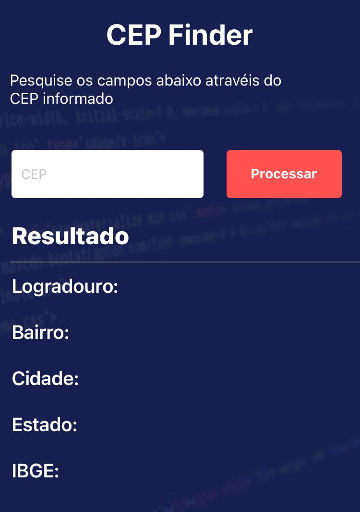

# Cep Finder App

App feito para buscar dados de Ceps usando a api do viacep.com.br

<div align="center">



</div>

## Getting Started

```bash

 Install the latest Node
 Install [Expo](https://expo.io/) - npm install expo-cli --global
 cd into this project directory
 npm install or yarn install
 Run expo start

 ```